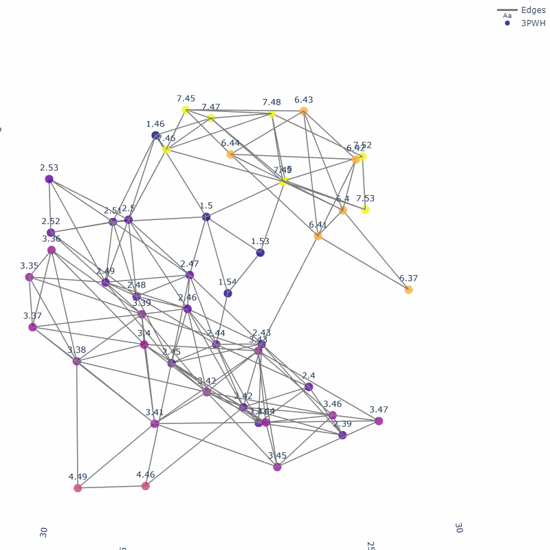
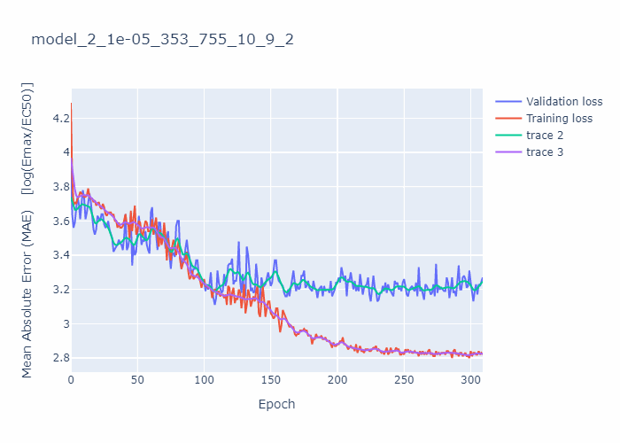

<h1 align="center">Master Thesis — GPCR Biased Signalling with Graph Neural Networks</h1>

<p align="center">
  <b>Represent GPCR–G-protein complexes as graphs; train GNNs to predict biased signalling.</b><br>
  A large-scale structural analysis of GPCRs — and the seed that grew into ProtOS.
</p>

<p align="center">
  
  &nbsp;
  
</p>
<p align="center"><i>Left: a GPCR binding region as a GRN-labelled contact graph. Right: GNN training (Emax / EC50).</i></p>

<p align="center">
  <a href="https://flurinh.github.io/aboutme">◆ Portfolio</a> &nbsp;·&nbsp;
  <b>The build:</b>
  <a href="https://github.com/flurinh/LM-DTA">LM-DTA</a> →
  <b>Master thesis</b> →
  <a href="https://github.com/flurinh/protos">ProtOS</a> →
  <a href="https://github.com/flurinh/MOGRN">MOGRN</a> →
  <a href="https://github.com/flurinh/lambda">Lambda</a> →
  <a href="https://github.com/flurinh/Protos_MCP">ProtOS-MCP</a>
</p>

---

## What it is

My MSc thesis (2021, Computational Macromolecular Therapy, Paul Scherrer Institut). I built a
structural database of available GPCRs and their G-protein complexes, annotated them with
Generic Residue Numbering, and turned the **G-protein binding region into a graph**. Graph
neural networks then learn to predict **biased signalling** — the potency and efficacy
(EC50 / Emax) with which a receptor couples to different G-protein families (Gi/o, Gq/11, Gs).

The data-management and graph machinery written here became the prototype for
**[ProtOS](https://github.com/flurinh/protos)**.

## What's inside

The analysis lives in Jupyter notebooks, run end-to-end via `WALKTHROUGH.py`:

- GPCR / G-protein complex processing + GRN annotation
- a local **graph representation** of the G-protein binding region
- pairwise distance & helix–helix angle analysis
- **graph neural network** training and analysis

## Setup

```bash
conda env create -f environment.yml
# then open WALKTHROUGH.ipynb and run all cells
```

(Originally run on PSI's *Merlin* cluster; see the notebook headers for cluster-specific paths.)

> Research code from 2021 — kept as a record of where ProtOS began.

---

<p align="center">
◀ <b>Previously:</b> <a href="https://github.com/flurinh/LM-DTA">LM-DTA — drugs & targets as language</a>
&nbsp;·&nbsp;
<b>Next:</b> <a href="https://github.com/flurinh/protos">ProtOS — what it became</a> ▶
</p>
